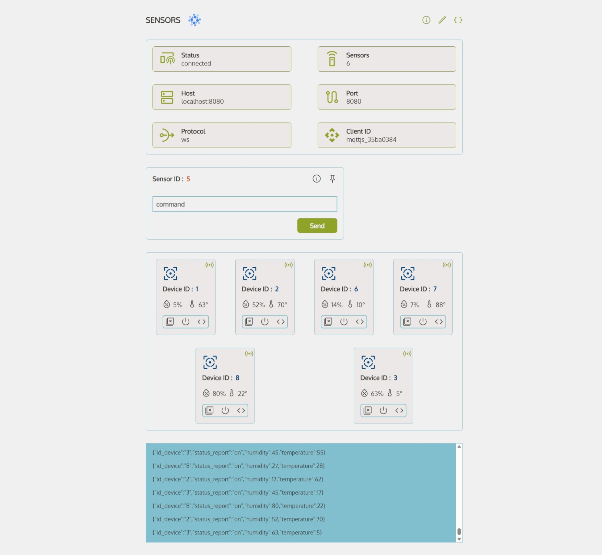

# Sensor Monitoting

Aplicación web para monitorear y controlar sensores de temperatura en tiempo real.  
Los sensores son emulados por un programa desarrollado en python.

## Prerrequisitos

≧◠‿◠≦

1. Instala Eclipse Mosquitto.
2. Crea un archivo mosquitto.conf en la ruta C:\ con la siguiente configuración.
   ```
   listener 1883
   protocol  mqtt

   listener 8080
   protocol websockets

   allow_anonymous true
   ```
3. Abre una terminal en la carpeta de istalación.
4. Ejecuta el comando `./mosquitto.exe -c C:\mosquitto.conf -v` para  
   iniciar el broker.
5. Requieres del siguiente repositorio
   [sensor-emulator](https://github.com/miniscandal/temperature-sensor-emulator)
   que sirve como un emulador  
   sensor de temperatura.

## Instalación

≧◠‿◠≦

1. Clona el repositorio `git clone https://github.com/miniscandal/sensor-monitoring` en tu computadora.
2. Abre una terminal en la carpeta del proyecto.
3. Ejecuta el comando `npm install` para instalar las dependencias del proyecto.
4. Ejecuta el comando `npm run dev` para iniciar la aplicación.

## Uso

≧◠‿◠≦



## Tecnologías


  


* Atomic Desing
* Vite

## Aprendizajes

≧◠‿◠≦

Mientras trabajaba en esta aplicación web, tuve la oportunidad de perfeccionar  
mis habilidades para crear una aplicación más eficiente y fácil de mantener.

La implementación de la metodología de diseño atómico y la componentización  
mejoro la estructura y organización de mi código.

Utilizar tecnologías para el Internet de las cosas me permitió tener una  
comunicación en tiempo real e interactiva.

El uso de patrones de diseño y atributos de datos personalizados en elementos  
mejoro la funcionalidad y flexibilidad de la aplicación.

## Documentación

≧◠‿◠≦

* [React](https://react.dev/)
* [MQTT.js](https://github.com/mqttjs/MQTT.js/)
* [Mosquitto](https://mosquitto.org/)
* [Vite](https://vitejs.dev/)

## Licencia

≧◠‿◠≦

Este proyecto está bajo la Licencia MIT - mira el archivo LICENSE para detalles.